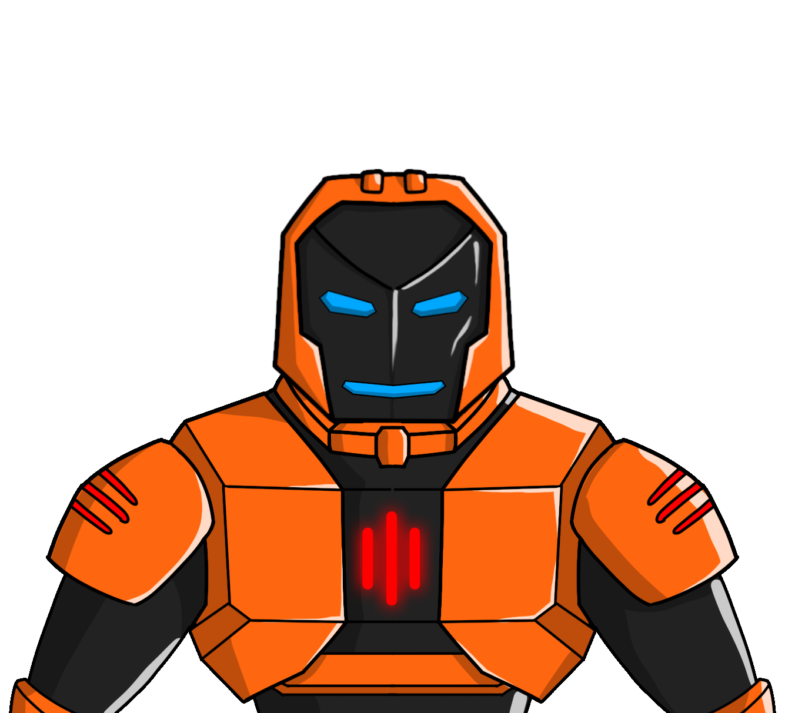

# BonaRobotics
BonaRobotics is a collectible NFT platform based on Binance Smart Chain with a limit of 1 million unique, randomly generated robots. 
<b>[Visit BonaRobotics](https://bonarobotics.com)</b>

 

<i>Smart contract address on Binance Smart Chain:</i> <b>[0x6EF9f05A4Eb8B7D7d89E916f6eF77547ae6aC10c](https://bscscan.com/address/0x6EF9f05A4Eb8B7D7d89E916f6eF77547ae6aC10c)</b>

<i>ABI:</i> [Link To File](./ABI)

This repository contains Solidity code for BonaRobotics NFT collectible platform. It consists of ERC721 and other multiple dependencies. 
Take a visit to [bonarobotics.com](https://bonarobotics.com) to find out more about the futuristic crypto robots!

### Social

Follow us on [Twitter](https://twitter.com/LabsXona)
 
Get in touch on [Discord](https://discord.com/invite/C2xX8aFvhN)

